## Beginner guide for git and github

Create a new repository and move to the new repository

```bash
  mkdir practice_git
  cd practice_git/
```

Then create a new file

```bash
  vim calci.sh
```

And add the following content to the file:

```bash
  x=a+b
```

Then initialize the git repository

```bash
  git init
```

Now check the status of git repository using the following command:

```bash
  git status
```

Now you will get an output like this:

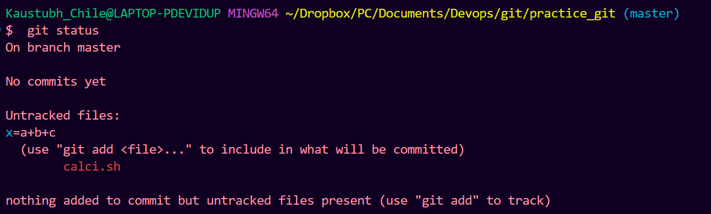

The output indicates we have untracked files. So to track it, we use the following command:

```bash
  git add calci.sh
```

Now check the 'git status' and the following changes will be visible:

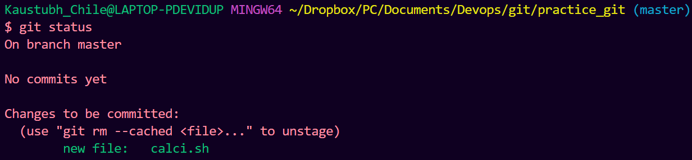

Now making changes to the tracked file itself by editing calci.sh using 'vim calci.sh' and then making the following modification

```bash
  x=a+b+c
```

Now when we run git status we get the following output

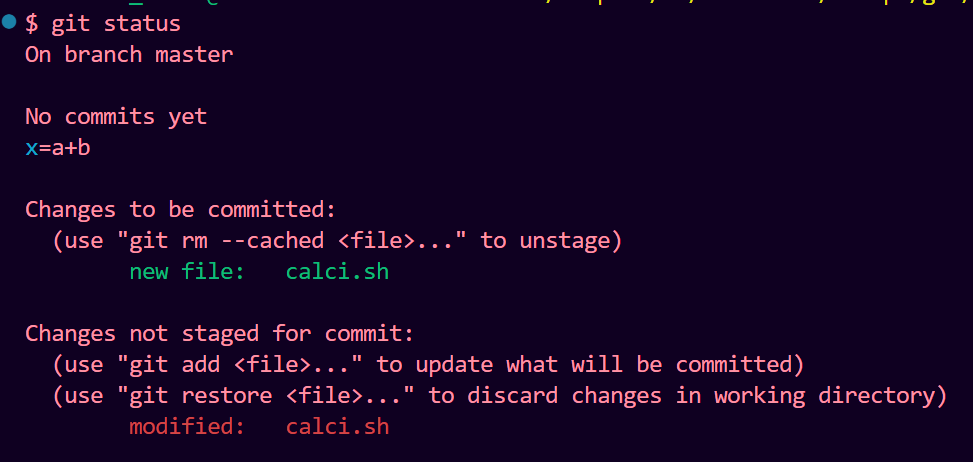

To see what changes one has made to a file we can use the following command which will display output like this

```bash
  git diff
```

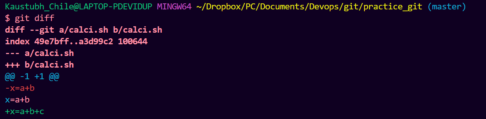

(Before moving forward edit your calci.sh content to x=a+b)

Now create a commit for calci.sh using the following command

```bash
  $ git commit -m "first version"
```

And then run 'git status' and following output gets visible

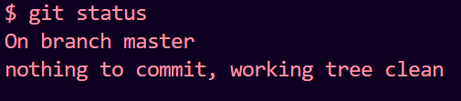

Now add a new line to calci.sh--> vim calci.sh --> and then add y=a-b

Now when to edit a file that has already been committed 'git status' results in the following:

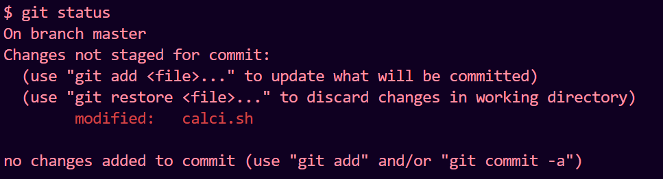

By running 'git diff' following output is visible

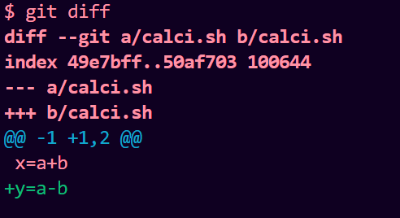

Now run the following commands and following output is obtained

```bash
  git add calci.sh
  git status
```

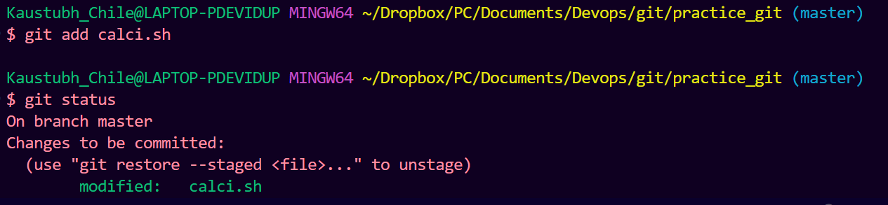

Then commit all your changes using the following commands and then do git status

```bash
  git commit -m "Second version"
  git status
```

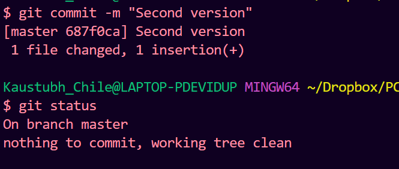

To display list of commits

```bash
  git log
```

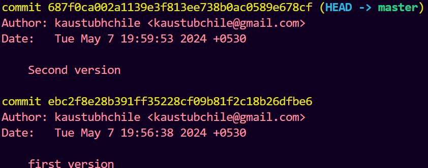

Now to push your code in a github repository first we have to create a github repository by going to github and then running the following commands to psuh your code to that repository

```bash
  git branch -M main
  git remote add origin https://github.com/kaustubhchile/git_practice_test.git
  git push -u origin main
```

And then the following output is visible

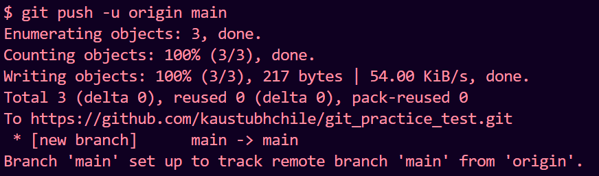
